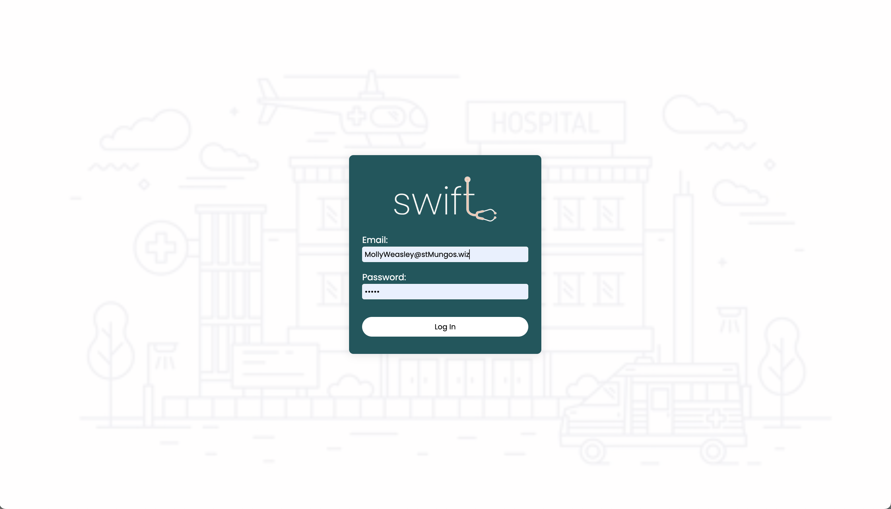
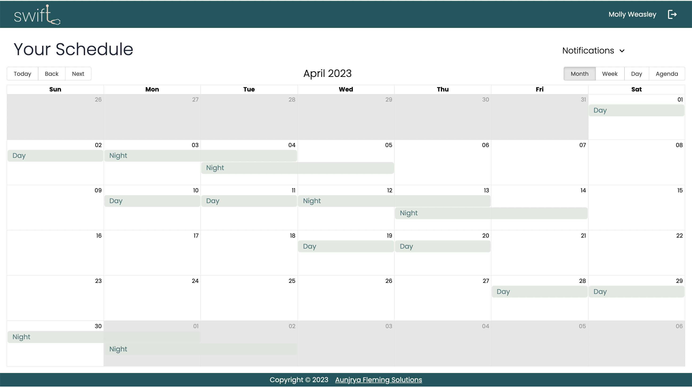
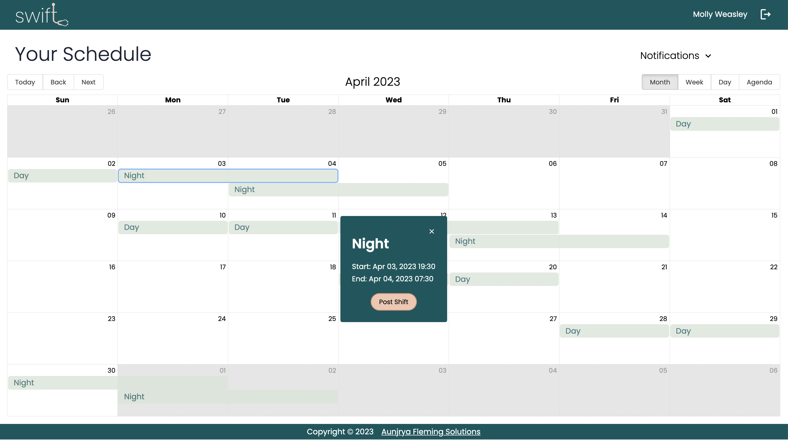
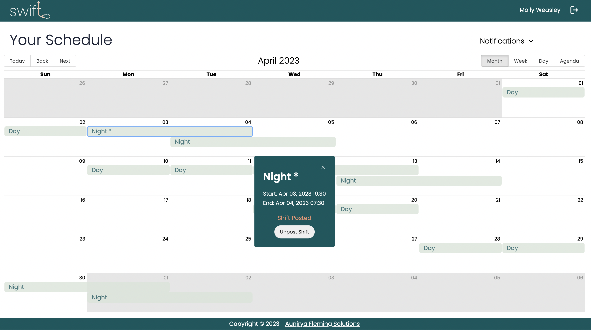
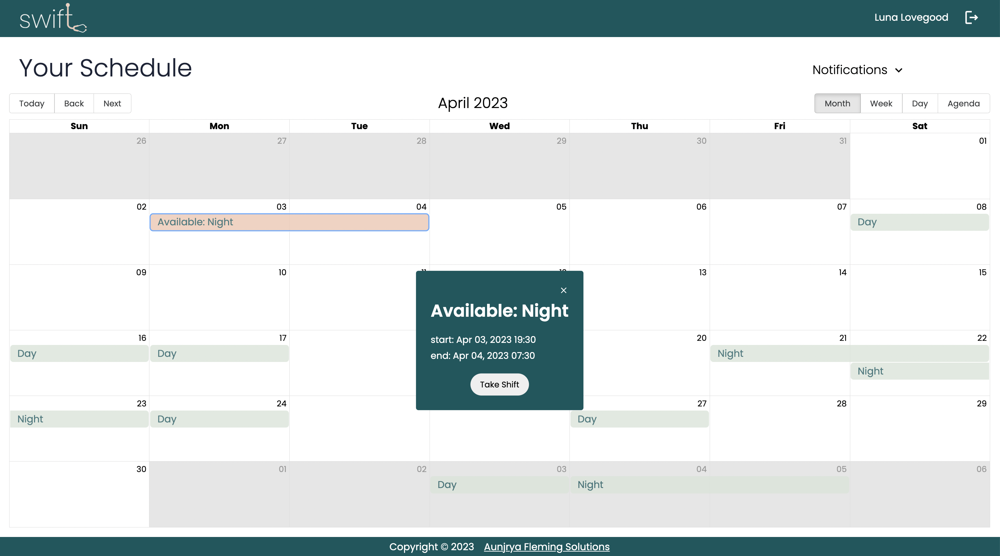
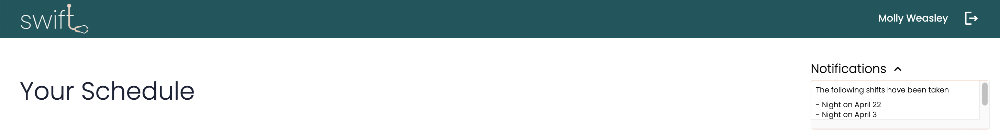

# Swift

Swift is an app designed for nurses to easily trade shifts in real-time. The app offers automated approvals and a user-friendly interface, streamlining the process and saving time. Swift benefits both nurses and managers by improving productivity and allowing more focus on critical tasks.


## Preview


Figure 1: Nurse, Molly Weasley, can log in using their compnay email and password.


Figure 2: Nurse Molly will then be brought to their personal calendar view.


Figure 3: Nurse Molly can then post a shift.


Figure 4: A modal will let Nurse Molly know the shift has been posted and '*' will appear beside the shift to indicate that it is actively up for grabs. Should Molly choose to take the shift back they can easily click on the shift to un-post it.


Figure 5: Nurse, Luna Lovegood, can log into their account, view and accept any available shift.


Figure 6: Nurse Molly will no longer see the shift in their schedule and can consult the notification center for confirmation. 


All successful switches are logged and the schedule changed immediately. Management and charge Nurses have access to infallible schedules and the log of switches should they want to review. 


## Installation

Follow these steps to install and set up the application.

### Prerequisites

Ensure that you have MySQL installed and running on your system before attempting to create the database.

### Clone the Repositories

```bash
  $git clone git@github.com:ParisianMist/swift.git
  $git clone git@github.com:ParisianMist/swift-api.git
```
### Set Up Environment Variables

Copy the contents of sample.env into a new file named .env:
```bash
  $cp .env.sample .env

```
Open the .env file and update the values according to your specific configuration. Save the .env file.

Ensure to configure both the front and back end .env files


### Database Setup

1. Ensure that you have MySQL installed and running on your system.
2. Open your MySQL client or command-line tool and log in with appropriate credentials.
3. Create a new database named "swift":
```bash
 CREATE DATABASE swift;
```

This command will create a new database named "swift" in your MySQL server.


### Migrate the Database 

1. Run the migration command to apply the database migrations:
```bash
$npm run migrate
```
2. Verify that the migrations have been applied by checking your database to see if the tables have been created.


### Seed the Database

1. Run the seeder command to populate the database with initial data:
```bash
$npm run seed
```
2. Verify that the seeding process was successful by checking your database to see if the expected data has been inserted.


### Install all dependencies
1. Navigate to the project directories:
```bash
  $cd ./swift
  $cd ./swift-api

```
 2. Run the following command in each repo:
```bash
  $npm install
```
This will install all the necessary dependencies listed in the package.json file.


## Usage

To use Swift run the follwing commands: 

1. Back-end:
```bash
$npm run dev

```
2. Front-end:
``` bash
$npm start
```
This will start the server and the applicatoin.

Use the following demo logins to test out the app:
```bash
email: MollyWeasley@stMungos.wiz
password: hp123

and 

email: LunaLovegood@stMungos.wiz
password: hp123
```

## Contact

- Aunjrya Fleming 
- For any questions or inquiries, please [Email Me](mailto:aunjrya@gmail.com)
- See what else I am working on, [@ParisianMist](https://www.github.com/ParisianMist)


## Tech Stack

Swift was built using the following technologies:

- SQL
- Axios
- Express
- Moment.js
- Node
- React
- React-Big-Calendar
- SASS